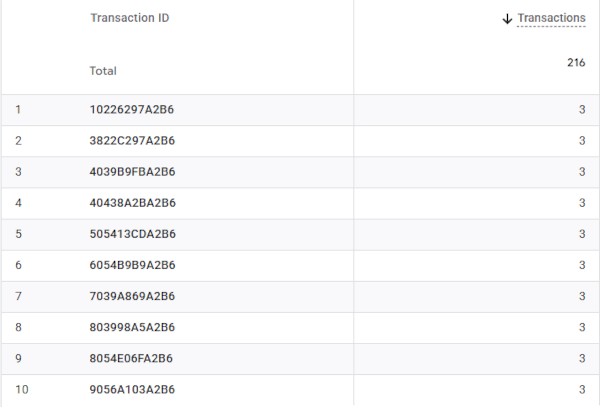
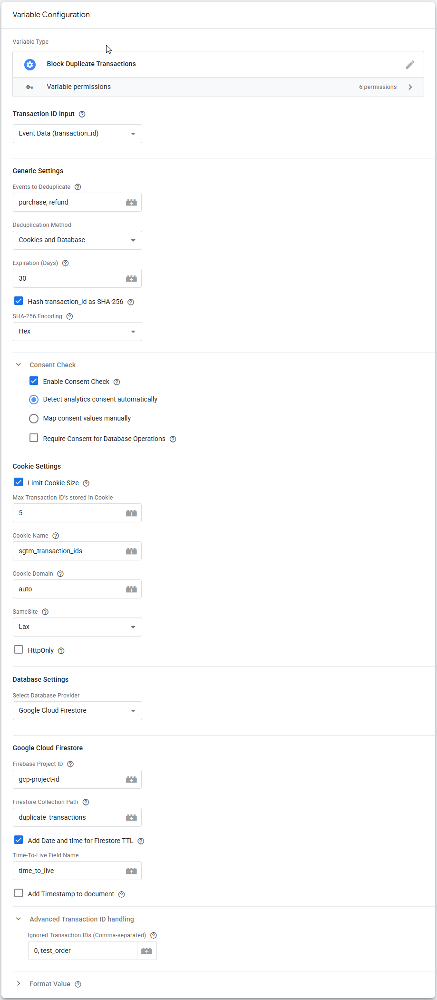
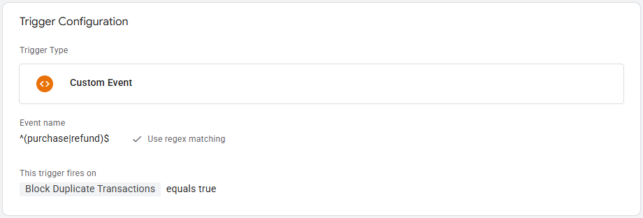
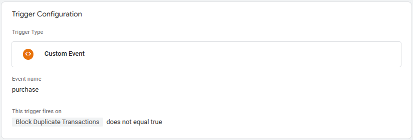

# Block Duplicate Transactions - SGTM Variable

This Variable for **Google Tag Manager Server-side (SGTM)** makes it possible to **Block Duplicate Ecommerce Transactions** from being sent to your analytics/marketing tools. 

It features a flexible architecture supporting **Cookie-only**, **Database-only**, and **Hybrid (Cookie + Database)** deduplication modes, ensuring duplicate transactions are blocked even when a user's session splits across different browsers (e.g., when returning from external payment apps).

This Template is available in the [**Google Tag Manager Template Gallery**](https://tagmanager.google.com/gallery/#/owners/gtm-templates-knowit-experience/templates/sgtm-block-duplicate-transactions).

## How the Variable Works
To prevent different event types from conflicting, the template automatically combines the **event_name** and **transaction_id** to create a unique, event-specific key (e.g., `purchase|12345` and `refund|12345`). This allows you to safely deduplicate both purchases and refunds for the exact same order without the database blocking the legitimate refund.

This unique key is checked against **earlier keys**. You can choose how this is handled using the Deduplication Mode setting:

1. **Cookie-only:** Checks if the key is stored in the user's browser cookie. This is instant, free, and standard for simple e-commerce setups.
2. **Database-only (Firestore or Stape):** Checks a centralized server-side database. Ideal for environments where cookies do not exist.
3. **Hybrid (Cookie + Database):** Uses the cookie as a lightning-fast, cost-saving local cache, and only queries the cloud database if the cookie doesn't have a match. This is the safest approach to catch cross-browser duplicates caused by external payment gateway redirects.

If **a match is found** in your selected storage, the Variable returns **true** (duplicate is true). You can then use this to block transactions in your Triggers.

If **no match is found**, the Variable returns **false** (duplicate is false), and the incoming key will be recorded. *(Note: Missing IDs or hardcoded JavaScript errors like `null` and `undefined` will always be ignored and return `false` to prevent blocking legitimate data).*

Since the [**Server-side GTM Firestore API**](https://developers.google.com/tag-platform/tag-manager/server-side/api#firestore) cannot directly utilize the standard to set [**Time-to-live (TTL)**](https://firebase.google.com/docs/firestore/ttl), this custom Template sends data directly to the [**Firestore API**](https://cloud.google.com/firestore/docs/reference/rest/v1/projects.databases.documents) using the **sendHttpRequest** function. Additionally, because the Server-side GTM API lacks native **Date** object support, the Template includes its own custom date-math routine to create and manage dates.

## Variable Settings

### 1. Event Gatekeeper & Transaction ID
- **Events to Deduplicate:** A comma-separated list of events to protect (e.g., `purchase`, `refund`). This gives you complete control. (Note: This template blocks identical event + transaction ID combinations. If your system sends multiple partial refunds for a single order, the second refund will be blocked. To prevent this, either remove `refund` from this list, or pass a custom constructed ID (e.g., `transaction_id + refund_id`) into the Transaction ID Variable field).
- **Transaction ID Variable:** By default, the template reads transaction_id from Event Data. You can override this by selecting a custom Variable. This is especially useful if you need to construct and pass a unique ID for complex scenarios like the partial refunds mentioned above.
- **Ignored Transaction IDs:** A comma-separated list of placeholder IDs (e.g., `0/0`, `test_order`) that should never be deduplicated. If an incoming ID matches this list, the template immediately returns `false` (allowing the tag to fire).
- **Hash transaction_id (SHA-256):** Hashes the ID value before storing it as a document field. Highly recommended for privacy. *(Note: To ensure optimal database performance and prevent URL path errors, the background Database Document ID is always securely hashed by the template).*

---

### 2. Deduplication Mode & Expiration
- **Deduplication Method:** Choose between `Cookies`, `Cookies and Database`, or `Database only`. Your choice dynamically reveals the relevant configuration fields below.
- **Expiration (Days):** A unified setting that determines both how long the cookie lives in the browser and the Time-to-Live (TTL) expiration date sent to Firestore.

---

### 3. Privacy & Consent Settings
By default, enabling the Consent Check acts as a global gatekeeper for both cookies and the database. If consent is denied, the template exits immediately without storing data.

- **Detect consent automatically:** Automatically reads Google Consent Mode v2 (`x-ga-gcd`) and v1 (`x-ga-gcs`) directly from event data, checking specifically if **analytics_storage** is granted.
- **Map consent values manually:** Use this for custom CMP setups. Map your custom variable (e.g., a query parameter reading `gcs`) to the expected granted value.
- **Require Consent for Database:** (Only visible if a database mode is selected). If checked, the database requires strict consent. If unchecked, the database bypasses the consent check and logs transactions server-side, while the cookie will not be written. If the cookie already exist, it will delete itself.

---

### 4. Cookie Settings
*(Visible unless Database-only mode is selected)*

- **Limit Cookie Size:** Limit the number of Transaction IDs stored in the cookie. When the limit is reached, the oldest ID is deleted (e.g., if the limit is 2, `["12", "34"]` becomes `["34", "56"]`).
- **Cookie Name:** Suggested: `duplicate_transactions`.
- **Cookie Domain:** If set to **auto**, it writes the cookie on the highest possible level in the domain name hierarchy.
- **SameSite:** Set to **Lax**, **Strict**, or **Value not set**.
- **HttpOnly:** If checked, the cookie is forbidden from being accessed by client-side JavaScript. (Must be unchecked if you need to read it in Web GTM).

---

### 5. Cloud Database Settings
*(Visible unless Cookie-only mode is selected)*

#### Firestore
If you require 100% strict deduplication, use **Google Cloud Firestore**. Firestore uses **atomic operations**, meaning it checks for a duplicate and writes the new transaction in one single, unbreakable step. When Firestore successfully processes both requests against the same document, only one creation can succeed; competing requests are rejected as duplicates.

Cloud databases like Firestore bill based on the number of reads and writes. A standard database check requires two operations for every new purchase: a **Read** (does this ID exist?) followed by a **Write** (save it). 

This template's atomic Firestore implementation uses a single, blind **POST** request. It attempts to create the document and relies on Firestore's native `409 Conflict` error to catch duplicates. For the vast majority of legitimate transactions, this cuts your database operations in half (1 Write, 0 Reads). 

When paired with the **Cookies and Database** mode, the template uses the free local browser cookie as a first-layer cache. The database is only queried when the cookie is missing (e.g., cross-browser payment redirects), keeping your Google Cloud billing low.

**Tracking Blocked Duplicates (GCP Logs)**

If you want to monitor how many duplicates Firestore has actively blocked, you can use the Google Cloud Logs Explorer or Stape outgoing request logs. Filter your Server-Side GTM environment logs for outgoing HTTP requests to the Firestore API that return a `409 Conflict` status code. Each 409 error represents a successfully blocked duplicate transaction.

#### Stape Store
**Stape Store** is an excellent, zero-setup alternative, but it uses a "best effort" two-step process (it checks the database, then writes to it). While highly effective, if two identical transactions arrive within milliseconds, a duplicate might occasionally slip through.

#### Option A: Using Google Cloud Firestore
Firestore is a powerful database hosted on Google Cloud. You can use it regardless of where your sGTM container is currently hosted.

**Configuration Steps:**
1. Go to the [Google Cloud Console](https://console.cloud.google.com/).
2. Navigate to **Firestore** and click **Create Database** (Select **Native Mode**).
3. **Set up Authentication:**
   * *If your sGTM is hosted on GCP:* Ensure your Compute Engine or App Engine default service account has the **Cloud Datastore User** role.
   * *If your sGTM is hosted on Stape:* Create a Service Account in GCP with the **Cloud Datastore User** role, generate a JSON key, and upload it in the Stape dashboard under **Power-Ups -> Google Service Account**.
4. In the Variable settings, set **Database Type** to `Firestore`.
5. Enter your **Firebase Project ID** and a **Firebase Path** (the collection name, e.g., `duplicate_transactions`).

**Managing Firestore Database Size (Timestamps & TTL)**
To prevent your Firestore database from growing indefinitely, this template supports two types of timestamps:
- **Add Unix Integer Timestamp:** Saves the time as an integer (e.g., `1787319427243`).
- **Add Date and time for Firestore TTL (Recommended):** Saves an ISO 8601 string calculated automatically based on your unified **Expiration (Days)** setting. 

**Note on SGTM Preview Mode & 409 Errors** 
If you are testing this template in SGTM Preview Mode and notice a `409` error in the outgoing HTTP requests to Firestore, this is the atomic deduplication working exactly as intended. When a duplicate transaction attempts to write an ID that already exists, Firestore rejects it with a 409 status code. The template anticipates this, catches the 409, and safely returns `true` to block your tags.

**How to activate automatic deletion (TTL) in Firestore:**
1. Check the **Add Date and time for Firestore TTL** box in the template settings.
2. Open the [Google Cloud Console](https://console.cloud.google.com/) and navigate to **Firestore > TTL (Time to live)**.
3. Click **Create Policy**.
4. **Collection group:** Enter the name of your Firebase Path.
5. **Timestamp field:** Enter the TTL field name from the template (default: `time_to_live`).
6. Click **Create**. Firestore will automatically delete old documents.

---

#### Option B: Using Stape Store
Stape Store is a built-in database solution exclusively for sGTM containers hosted on [Stape.io](https://stape.io). It requires no external Google Cloud setup.

**Configuration Steps:**
1. In the Variable settings, set **Database Type** to `Stape Store`.
2. Enter a **Stape Collection Name** (e.g., `duplicate_transactions`).
3. **Time-to-live** settings for Stape Store are managed directly inside your **Stape Store collection settings** in the Stape Dashboard.

## Trigger Settings for Blocking Duplicate Transactions
You can either include the rule into your existing (purchase) trigger or create a dedicated blocking trigger.

### Blocking Trigger (Exception)
I recommend using a blocking trigger.

- Add the condition as shown in the image below:
  * TheNameYouHaveGivenThisVariable *equals* **true**

### Existing Trigger

- Edit your existing Trigger(s)
- Add the condition as shown in the image below:
  * TheNameYouHaveGivenThisVariable *does not equal* **true**

Solution by [**Eivind Savio**](https://www.savio.no/google-tag-manager/block-duplicate-transactions-atomic-firestore-solution) from [**Knowit AI & Analytics**](https://www.knowit.no/hva-vi-tilbyr/merkevare-og-markedsforing/maling-og-dataanalyse/) (Oslo, Norway). Not officially supported by Knowit.
